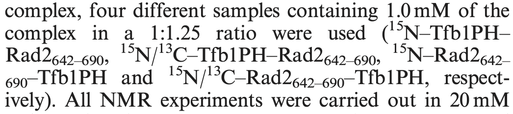

# Poppler-science: rich text extraction from (scientific) PDF files

This is Poppler-science, an ongoing experiment to improve the extraction of rich text from PDF files. In this case, "rich text" refers to
[Unicode](https://en.wikipedia.org/wiki/List_of_Unicode_characters) text, superscripts, subscripts, and high-level document structure 
(i.e., headers, footers, left and right margin text, and text that
appears in tables and figures). Poppler-science is an experimental fork of the Poppler project (version 25.06.0), [README-Poppler](README-Poppler.md), which
in turn came from XPDF; see [README-XPDF](README-XPDF) for the original xpdf-3.03 README. Like Poppler, Poppler-science is [licensed under the GPL](LICENSE.txt).

The goal of Poppler-science is to accurately extract text-based information from PDF files as quickly as possible. Benefits include improving the accuracy of retrieval augmented generation (RAG) applications and reducing false negatives when searching PDF files with text-based queries. To demonstrate proof-of-principle, a new version of `pdftotext` is provided by Poppler-science. Please note that the other Poppler utilities (i.e., `pdftohtml`, `pdftoppm`, etc.) have *not* been modified.

## Key features of Poppler-science include:
- An integrated multilayer perceptron to predict Unicode values from *individual* font glyph bitmaps -- this is "per character" optical character recognition (OCR).
- Superscript and subscript text identification based on text position and size using simple coding heuristics. 
- Per-page text string ordering inference using single linkage clustering. 
- High-level document structure inference (using location and word density-based heuristics) at the level of:
  - Header
  - Footer
  - Left margin
  - Right margin
  - "Data" -- which can be either a table or figure. While many scientific PDF files use bitmap-based figures, it is not uncommon for a bitmap figure to also have a text overlay, which will be extracted.

### Please note that for PDF files that contain pixel-based images, full-page optical character recognition (OCR) is needed to extract text from these images. Neither Poppler-science nor Poppler performs full-page OCR and are *not* useful for extracting text from purely image-based PDFs (i.e., scanned documents). Checkout tools like [Tesseract](https://github.com/tesseract-ocr) for extracting text from bitmapped images.

## Accurate Unicode text extraction
Doesn't Poppler (and [every other PDF-to-text program](https://en.wikipedia.org/wiki/List_of_PDF_software)) already extract Unicode characters from PDF files? 

The answer is, "most of the time, but not always".

 For PDF files that contain text information, most PDF-to-text tools only extract the text strings that are *reported* by the PDF file. These text strings can be (and often are) *different* than the strings *displayed* when the PDF file is graphically rendered. PDF creation software has the power to associate *any* Unicode value with *any* font glyph (and there are no checks to make sure that this mapping is correct).

Why would a software package generate a PDF that contains embedded text that does not match the displayed text? This is a great question for which I do not know the answer! [There](https://stackoverflow.com/questions/28678841/pdf-text-extraction-returns-wrong-characters-due-to-tounicode-map) [are](https://lists.freedesktop.org/archives/poppler/2012-April/009035.html), [however](https://lists.apache.org/thread/gzxw7lv9yqjox4q59dojwr6533lbnbnc), [many](https://stackoverflow.com/questions/9224211/extract-text-from-corrupt-pdf-document) [examples](https://stackoverflow.com/questions/12184304/extracting-text-from-garbled-pdf) of embeded text *not* matching displayed text. This is problem, since most (all?) of the commonly available 
[PDF-to-text software tools]((https://en.wikipedia.org/wiki/List_of_PDF_software)) explicitly trust the source PDF file to contain embedded Unicode text strings that 
match the text that will be graphically displayed.

### Displayed &#x2260; embedded text string example: Microsoft Word
Using a modern version of Microsoft Word for MacOS (Version 16.105):
- Create a new document that contains a single word "difficult" in the "Aptos (Body)" font (which appears to be the default font circa early 2026)
- Save this document as a PDF file. 
- Open this newly created PDF document in the MacOS "Preview" PDF viewer and copy the displayed word "difficult" to the clipboard.
- Paste the clipboard contents into a new Microsoft Word document.
- Instead of "difficult", you will see "di#icult".
  
What just happedened? When creating the PDF file, MS Word replaced the two adjacent "f" characters in "difficult" with a single Unicode character representing the "&#xFB00;" ligature (where a [ligature](https://en.wikipedia.org/wiki/Ligature_(writing)) contains multiple symbols/characters in a single font glyph). However, rather than embedding a valid Unicode code for "&#xFB00;" (= 0xFB00), MS Word embedded the Unicode symbol "#" (= 0x0023).

Note that the choice to replace two characters "ff" with a single ligature character "&#xFB00;" is font dependent. If the above example is repeated using the "Times New Roman" font in MS Word, the resulting PDF file does *not* contain a ligature and the embedded text matches the displayed text (as expected).

### Displayed &#x2260; embedded text string example: Scientific literature
The final form for many (most?) scientific manuscripts is a PDF file. Scientific manuscripts often contain a mixture of many different Unicode symbol types (e.g., English, Greek, math symbols, etc.). When embedded characters don't match the displayed characters, the resulting extracted text can have dramatically different meaning. One example is when the displayed Greek symbol "&#xB5;" (for micro) is assigned the Unicode value "m". When this change happens in units of concentration (i.e., "3.3 &#xB5;M"), the resulting text extraction error (i.e., "3.3 mM" instead of "3.3 &#xB5;M") yields a *drastically* different concentration! Since both "&#xB5;M" (micromolar) and "mM" (milimolar) are valid units of concentration, this error can be difficult to detect. There are recent [research](https://pubmed.ncbi.nlm.nih.gov/40815276/) 
[papers](https://cebs.niehs.nih.gov/cebs/paper/16105) that use OCR to correct errors specifically related to concentration units, but do not provide a more general solution for the diverse set of Unicode symbols that commonly appear in scientifc PDF files.

### Poppler-science strategy for accurate Unicode symbol extraction
Poppler-science performs "per character" optical character recognition when extracting embedded text strings from PDF files. Unlike most existing pdf-to-text software tools, the Unicode values embedded in a PDF file are *not* directly used. Instead each font glyph is internally rendered as a small bitmap image that is input to an internal multilayer perceptron (MLP) algorithm to predict the corresponding Unicode value. Here are some details:
- The MLP algorithm is only envoked when a new font glyph is encountered. Previous prediction results are stored in memory to allow fast lookup of Unicode values for font glyphs previously encountered in the current PDF file.
- The MLP algorithm was trained by:
  - Extracting bitmaps for all font glyphs from 685100 [Open Access](https://pmc.ncbi.nlm.nih.gov/tools/openftlist/) PDF files downloaded from [PubMed Central](https://pmc.ncbi.nlm.nih.gov/). The streaming download of PDF files from PMC and the subsequent font extraction is performed by the [stream_PMC](glyph/stream_PMC.py) script.
  - For each unique Unicode value, the set of font glyph bitmaps were manually checked by visual inspection. Font glyphs that did not match Unicode value were excluded from the training set.
    - The [select_glyph](glyph/select_glyph.cpp) C++ program visualizes font glyph bitmaps using the text-based [ncurses](https://en.wikipedia.org/wiki/Ncurses) library. This tool enables a user to quickly screen individual font glyph bitmaps and identify glyphs that need to be excluded.
      - The `select_glyph` program also requires the [GNU Scientific Library (GSL)](https://www.gnu.org/software/gsl/). The GSL provides the [singular value decomposition](https://www.gnu.org/software/gsl/doc/html/linalg.html#singular-value-decomposition) routine that is used to compute the [Mahalanobis distance](https://en.wikipedia.org/wiki/Mahalanobis_distance) between individual font glyph bitmaps and the single "average" font glyph bitmap for a given Unicode value. When displaying the glyph bitmaps associated with a given Unicode value, the initial ordering is by Mahalanobis distance (in descending order), which tends to place "outlier" (i.e., mislabeled) glyphs at the beinging of the display list.
    - The manual screening process is by no means perfect! In addition to user error (checking glyph images too far past bedtime), there are many "look alike" Unicode symbols that are very difficult for a human to distinguish. For example:
      - &#xb5; ("micro", 0xB5) versus &#x3bc; ("Greek small letter mu", 0x3BC)
      - &#xd7; ("times", 0xD7) versus &#x78; ("Latin small letter x", 0x78)
      - &#x1e9f; ("Latin small letter delta, 0x1E9F") versus &#x3B4; ("Greek small letter delta", 0x3B4)
      - &#x3B3; ("Greek small letter gamma", 0x3B3) versus &#x79; ("Latin small letter Y", 0x79)
      - &#x391; ("Greek capital letter Alpha", 0x391) versus &#x41; ("Latin capital letter A", 0x41)
      - and many, many others ...
  - A two-layer MLP, each layer with 3000 and 2000 nodes in each layer, was trained using Pytorch on an Apple M3 Mac Studio. Please see of the [classify_glyph.py](glyph/classify_glyph.py) script for the implementation. The MLP architecture was inspired by existing strategies for [classifying handwritten digits](https://en.wikipedia.org/wiki/MNIST_database). After model training, the `classify_glyph.py` script write the model parameters to disk in a binary format.
  - The training set of bitmap-to-Unicode mappings was downselected to contain 650544 unique font glyph bitmaps for 862 different Unicode values representing a core set of commonly used Unicode values. The full set contained 864526 glyph bitmaps for 15208 different Unicode values. To reduce the complexity of the MLP model, Unicode values that were mostly found manuscript author name list were not included in the final training set.
- The [binary file of multilayer perceptron parameters](glyph/unicode_mlp_model_param.bin) (approximately 89 MB) are currently loaded from disk every time the Poppler-science pdftotext program is run.
- The inference of a Unicode value from an internal font glyph bitmap is [implemented in C++](poppler/MLP.cc) and performed using the CPU (using SIMD vector instructions). As a result, there is *no* dependancy on Pytorch software or GPU hardware.

## Superscript and subscript extraction
Many scientific PDF documents contain equations and/or technical names (e.g., H<sub>2</sub>O) with subscript and/or superscript text. Since most pdf-to-text applications group text into lines based on a shared baseline (i.e., the coordinate of the bottom of each letter), superscript text might appear on a line above and subscript text might appear on a line below. First, the spurious insertion of additional lines makes the resulting text more difficult to interpret. Second, when superscript/subscript text is displayed inline, the resulting concatination of regular text with superscript/subscript text can confound the identification and interpretation of names (i.e., the "[named entity recgonition](https://en.wikipedia.org/wiki/Named-entity_recognition)" problem). For example, naively extracting text from the scientific PDF [manuscript](https://pmc.ncbi.nlm.nih.gov/articles/PMC3384317/) displaying:

 
 
 yields:

```
complex, four different samples containing 1.0 mM of the
complex in a 1:1.25 ratio were used (15N–Tfb1PH–
Rad2642–690, 15N/13C–Tfb1PH–Rad2642–690, 15N–Rad2642–
15
N/13C–Rad2642–690–Tfb1PH, respect690–Tfb1PH and
ively). All NMR experiments were carried out in 20 mM
```

where the superscript text string "15" appears on a line by itself, the subscript text, <sub>642-690</sub>, has been appended to the molecule name "Rad2", and text of the penultimate line is now out of order!

However, using the Poppler-science `pfttotext` to extract this same block of text yields:

```
complex, four different samples containing 1.0 mM of the
complex in a 1:1.25 ratio were used (<sup>15</sup>N–Tfb1PH–
Rad2<sub>642–690</sub>, <sup>15</sup>N/<sup>13</sup>C–Tfb1PH–Rad2<sub>642–690</sub>, <sup>15</sup>N–Rad2<sub>642–</sub>
<sub>690</sub>–Tfb1PH and <sup>15</sup>N/<sup>13</sup>C–Rad2<sub>642–690</sub>–Tfb1PH, respect-
ively). All NMR experiments were carried out in 20 mM
```

which outputs HTML tags to preserves the superscript and subscript structure of the source PDF file. Since the supscript and subscript HTML tags are valid Markdown, this text is easily displayed as: "complex, four different samples containing 1.0 mM of the
complex in a 1:1.25 ratio were used (<sup>15</sup>N–Tfb1PH–
Rad2<sub>642–690</sub>, <sup>15</sup>N/<sup>13</sup>C–Tfb1PH–Rad2<sub>642–690</sub>, <sup>15</sup>N–Rad2<sub>642–</sub>
<sub>690</sub>–Tfb1PH and <sup>15</sup>N/<sup>13</sup>C–Rad2<sub>642–690</sub>–Tfb1PH, respect-
ively). All NMR experiments were carried out in 20 mM"

## Document structure extraction
Poppler-science uses word location, word density, and page orientation to identify the following high-level document structures:
- Header (isolated text at the top of a page)
- Footer (isolated text at the bottom of a page)
- Left margin (isolated text at the left hand edge of a page)
- Right margin (isolated text at the right hand edge of a page)
- "Data" -- which can be either a table or figure.

The Poppler-science version of `pdftotext` can exlude any combination of header (using `--noheader`), footer (using `--nofooter`), left margin (using `--noleftmargin`), or right margin (`--norightmargin`) text. Excluding some information can be useful when extracting text from scientific documents that display redundant information (e.g., journal name, article metadata, etc.) on every page.

The Poppler-science version of `pdftotext` can also annotate high-level document structures using HTML-style tags:
- Header: `<header> ... </header>` (enabled using `-tag.section.header`)
- Footer: `<footer> ... </footer>` (enabled using `-tag.section.footer`)
- Left margin: `<left_margin> ... </left_margin>` (enabled using `-tag.section.leftmargin`)
- Right margin: `<right_margin> ... </right_margin>` (enabled using `-tag.section.rightmargin`)
- Data: `<data> ... </data>` (enabled using `-tag.section.data`)

While the header, footer, left margin and right margin tags can each appear 0 or 1 times, there can be any number of data tags.

When the `--tag.section.data` (or `--tag.section`) flag is passed to `pdftotext`, table and figure text are enclosed in the `<data> ... </data>` tags and the enclosed text is output in a "raw" format that attempts to perserve the relative positions and column alignments of data text. This formatting appears to help large language models parse tabular data (even though Poppler-science does not attempt to extract table row, column, or header information).

# How to build Poppler-science
Poppler-science uses the same CMake-based build system as Poppler. Additional C++ files ([`TextOutputDevOCR.cc`](poppler/TextOutputDevOCR.cc) and [`MLP.cc`](poppler/MLP.cc)) have been added to the [`CMakeLists.txt`](CMakeLists.txt) file. Other Poppler code files were also modified.

1. Download the Poppler-science project from GitHub
2. Like, Poppler, Poppler-science also depends on [Freetype](https://freetype.org/) and [Fontconfig](https://www.freedesktop.org/wiki/Software/fontconfig/). Both of these libraries must be downloaded, compiled and installed. The remaining instruction assume that these libraries will be subdirectories of the main `poppler-science` directory.
3. Create a `build` sub-directory in the main `poppler-science` directory. 
4. Run `cmake` to create the required Makefiles
  - For Linux users, here is an example CMake command to configure Poppler-science:
```
cmake ../ \
    -DFREETYPE_LIBRARY=$HOME/src/poppler-science/freetype/lib/libfreetype.so \
    -DFREETYPE_INCLUDE_DIRS=$HOME/src/poppler-science/freetype/include/freetype2 \
    -DFontconfig_LIBRARY=$HOME/src/poppler-science/fontconfig/lib/libfontconfig.so \
    -DFontconfig_INCLUDE_DIR=$HOME/src/poppler-science/fontconfig/include \
    -DENABLE_NSS3=OFF \
    -DENABLE_GPGME=OFF \
    -DENABLE_DCTDECODER=libjpeg \
    -DENABLE_QT5=OFF \
    -DENABLE_QT6=OFF \
    -DENABLE_BOOST=OFF \
    -DENABLE_DCTDECODER=libjpeg \
    -DENABLE_LIBOPENJPEG=unmaintained \
    -DENABLE_LCMS=OFF
```
  - For MacOS users, configuration is more complex. One can either use a package manager (i.e., [homebrew](https://brew.sh/)) or manually download, compile and install all of the dependancies that Linux users take for granted! In addition to the `Freetype` and `Fontconfig` libraries mentioned in step 2, here are the libraries that MacOS users will (probably) need to install:
    - [pkg-config](https://www.freedesktop.org/wiki/Software/pkg-config/)
    - [LibTIFF](https://libtiff.gitlab.io/libtiff/)
    - [libpng](https://www.libpng.org/pub/png/libpng.html)
    - [libjpeg-turbo](https://sourceforge.net/projects/libjpeg-turbo/)
  - For MacOS users, here is an example CMake command to configure Poppler-science:
  ```
  cmake ../ \
    -DFREETYPE_LIBRARY=$HOME/src/poppler-science/freetype/lib/libfreetype.6.dylib \
    -DFREETYPE_INCLUDE_DIRS=$HOME/src/poppler-science/freetype/include/freetype2 \
    -DFontconfig_LIBRARY=$HOME/src/poppler-science/fontconfig/lib/libfontconfig.1.dylib \
    -DFontconfig_INCLUDE_DIR=$HOME/src/poppler-science/fontconfig/include \
    -DPKG_CONFIG_EXECUTABLE=$HOME/src/poppler-science/pkg-config/bin/pkg-config \
    -DENABLE_NSS3=OFF \
    -DENABLE_GPGME=OFF \
    -DTIFF_INCLUDE_DIR=$HOME/src/poppler-science/libtiff/include \
    -DTIFF_LIBRARY=$HOME/src/poppler-science/libtiff/lib/libtiff.dylib \
    -DPNG_PNG_INCLUDE_DIR=$HOME/src/poppler-science/libpng/include \
    -DPNG_LIBRARY=$HOME/src/poppler-science/libpng/lib/libpng.dylib \
    -DENABLE_DCTDECODER=libjpeg \
    -DENABLE_QT5=OFF \
    -DENABLE_QT6=OFF \
    -DENABLE_BOOST=OFF \
    -DENABLE_DCTDECODER=libjpeg \
    -DJPEG_INCLUDE_DIR=$HOME/src/poppler-science/libjpeg/include \
    -DJPEG_LIBRARY=$HOME/src/poppler-science/libjpeg/lib/libjpeg.dylib \
    -DENABLE_LIBOPENJPEG=unmaintained \
    -DENABLE_LCMS=OFF
  ```
5. Run `make pdftotext` to build the Poppler-science version of `pdftotext`. 
  - The default installation directory, specified in [`CMakeLists.txt`]() was changed to `${CMAKE_INSTALL_PREFIX}/share/poppler-science` to reduce the risk of clobbering an existing Poppler installation. Currenty, the Poppler-science uses the *exact same file names* for `libpoppler` and the Poppler utility executable files, so these files should not be installed to the same location as the Poppler files of the same name!
  - Note that all of the other Poppler utilities are still part of the CMake configuration, are unmodified, and should build and run as expected.

# How to run Poppler-science: pdftotext
Running `pdftotext -h` will output the allowed command line arguments. Many are same as the Poppler `pdftotext` program. Here are the command line arguments that Poppler-science version of `pdftotext` shares with the Poppler version of `pdftotext`:

```
Usage: pdftotext [options] <PDF-file> [<text-file>]
  -f <int>                         : first page to convert
  -l <int>                         : last page to convert
  -r <fp>                          : resolution, in DPI (default is 72)
  -x <int>                         : x-coordinate of the crop area top left corner
  -y <int>                         : y-coordinate of the crop area top left corner
  -W <int>                         : width of crop area in pixels (default is 0)
  -H <int>                         : height of crop area in pixels (default is 0)
  -nodiag                          : discard diagonal text
  -enc <string>                    : output text encoding name
  -listenc                         : list available encodings
  -eol <string>                    : output end-of-line convention (unix, dos, or mac)
  -nopgbrk                         : don't insert page breaks between pages
  -colspacing <fp>                 : how much spacing we allow after a word before considering adjacent text to be a new column, as a fraction of the font size (default is 0.7, old releases had a 0.3 default)
  -opw <string>                    : owner password (for encrypted files)
  -upw <string>                    : user password (for encrypted files)
  -q                               : don't print any messages or errors
  -v                               : print copyright and version info
  -h                               : print usage information
  -help                            : print usage information
  --help                           : print usage information
  -?                               : print usage information
  ```

  Here are the command line parameters that are specific to the Poppler-science version of `pdftotext`:
  ```
  -ocr.model <string>              : machine learning model parameters for OCR glyph classification
  -ocr.best_threshold <fp>         : minimum threshold for highest probability OCR inferred glyph
  -ocr.self_threshold <fp>         : maximum threshold for probability of reported glyph
  -ocr.dump_glyphs <string>        : write glyph bitmaps to file
  -noheader                        : don't output page headers
  -noleftmargin                    : don't output left margin text
  -norightmargin                   : don't output right margin text
  -nofooter                        : don't output page footers
  -tag.section                     : output HTML tags for all sections
  -tag.section.data                : output HTML tags for data (table/figure) sections
  -tag.section.header              : output HTML tags for header sections
  -tag.section.leftmargin          : output HTML tags for left margin sections
  -tag.section.rightmargin         : output HTML tags for right margin sections
  -tag.section.footer              : output HTML tags for footer sections
  -tag.superscript                 : output HTML superscript tags
  -tag.subscript                   : output HTML subscript tags
  -splitligature                   : decompose unicode ligatures into separate characters
```

Please note the following:
- For per-character optical character recogition:
  - A machine learning parameter file (specified by `-ocr.model`) is required to predict Unicode values from individual font glyphs. A parameter file for a pretrained MLP modle is provided in [unicode_mlp_model_param.bin](glyph/unicode_mlp_model_param.bin).
  - The argument to `-ocr.best_threshold` is a numeric value between 0.0 and 1.0 that must be *exceeded* by the proability of the predicted Unicode value computed by the MLP model. This threshold is used to reduce the Unicode classification error rate for "look alike" Unicode symbols. The default value is currently `0.25`.
  - The argument to `-ocr.self_threshold` is a numeric value between 0.0 and 1.0 that must *not* be exceeded by the proability of the Unicode value that is embedded in the PDF file (as computed by the MLP model). This threshold is used to reduce the Unicode classification error rate for "look alike" Unicode symbols. The default value is currently `0.01` .
  - The `-ocr.dump_glyphs` argument writes all unique font glyph bitmaps found in the specified PDF file to the specified output file. WHile the format of this binary file still needs to be documented the [unique_glyph.cpp](glyph/unique_glyph.cpp), [select_glyph.cpp](glyph/select_glyph.cpp) and [classify_glyph.py](glyph/classify_glyph.py) provided examples on how to read and write this format.
- For supscript and supscript output:
  - By default, the Poppler-science `pdftotext` program does not identify superscript or subscript text. This functionality is enabled using the `-tag.superscript` and `-tag.subscript` flags.
- For section tagging:
  - By default, the Poppler-science `pdftotext` program does *not* identify document sections. This functionality can be enabled for *all* section types using `-tag.section` or for specific sections using `-tag.section.data`, `-tag.section.header`, `-tag.section.footer`, etc.